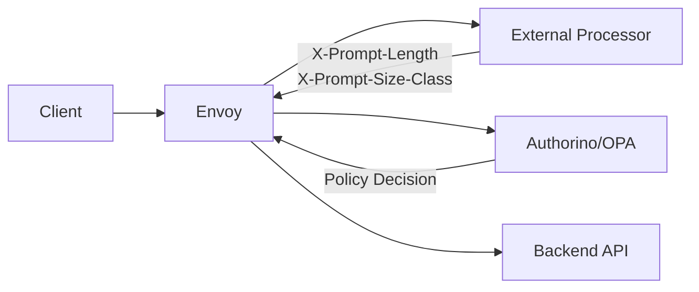

# Prompt Length External Processor Demo

This demo implements a Go-based Envoy External Processor that computes prompt length from JSON request bodies and injects metadata headers for policy decisions by Authorino/OPA and Kuadrant.

## Architecture



## How It Works

1. **Request Processing**: Client sends JSON with `{"prompt": "..."}` to Envoy
2. **External Processing**: Envoy buffers request body and sends to Go processor via gRPC
3. **Prompt Analysis**: Processor extracts prompt, calculates length, determines size class
4. **Header Injection**: Processor injects `X-Prompt-Length` and `X-Prompt-Size-Class` headers
5. **Policy Evaluation**: Authorino/OPA reads headers and makes policy decisions
6. **Rate Limiting**: Kuadrant applies different limits based on prompt size class

## Prerequisites

- Go 1.23+ (for local build)
- Docker (for Kubernetes deployment)
- kubectl configured with your cluster
- (Optional) KIND for local Kubernetes clusters

## Quick Setup

**Install Kuadrant and required CRDs:**

```bash
helm repo add kuadrant https://kuadrant.io/helm-charts && \
helm repo update && \
helm install kuadrant-operator kuadrant/kuadrant-operator --create-namespace --namespace kuadrant-system && \
kubectl apply -f - <<EOF
apiVersion: kuadrant.io/v1beta1
kind: Kuadrant
metadata:
  name: kuadrant
  namespace: kuadrant-system
EOF
```

**Build and deploy:**

```bash
# Build processor image
cd processor
make docker

# For KIND: Load image locally
kind load docker-image processor:latest --name your-cluster-name

# Deploy all components
cd ..
kubectl apply -f prompt-length-demo.yaml
```

**Verify deployment:**

```bash
kubectl get pods -n prompt-demo
# Both pods should show Running status
```

## Testing

**Test the demo:**

```bash
# Set up port forwarding
kubectl port-forward -n prompt-demo svc/envoy 8080:8080 &

# Test small prompt
curl -X POST http://localhost:8080/post \
  -H "Content-Type: application/json" \
  -d '{"prompt": "What is Kubernetes?"}'

# Test large prompt  
curl -X POST http://localhost:8080/post \
  -H "Content-Type: application/json" \
  -d '{"prompt": "'$(printf '%*s' 2500 '' | tr ' ' 'a')'"}'
```

**Check processor activity:**
```bash
kubectl logs -n prompt-demo -l app=processor --tail=10
```

## Size Classification

- **Small**: < 1024 characters → 100 requests/minute
- **Medium**: 1024-2047 characters → 50 requests/minute  
- **Large**: ≥ 2048 characters → 10 requests/minute

## Key Features

✅ **Privacy Protection**: Full prompts never reach Authorino/Kuadrant  
✅ **Smart Classification**: Automatic size-based rate limiting  
✅ **Policy Integration**: Headers enable AuthPolicy and RateLimitPolicy decisions  
✅ **Observability**: OpenTelemetry-ready with timing metrics  
✅ **Production Ready**: Proper error handling and validation

## Configuration

The processor supports configurable thresholds via environment variables:

```yaml
env:
  - name: SMALL_THRESHOLD
    value: "1024"
  - name: MEDIUM_THRESHOLD  
    value: "2048"
  - name: LARGE_THRESHOLD
    value: "2048"
```

## Development

**Run unit tests:**
```bash
cd processor
make test
```

**Local development:**
```bash
cd processor
make build
./processor
```

## Cleanup

```bash
kubectl delete -f prompt-length-demo.yaml
kubectl delete namespace prompt-demo
```

## Files Structure

```
demos/prompt-length-external-processor/
├── README.md                          # This documentation
├── prompt-length-demo.yaml           # Complete Kubernetes deployment
└── processor/                        # Go implementation
    ├── Dockerfile                    # Container build
    ├── Makefile                      # Build automation
    ├── go.mod                        # Go dependencies
    ├── cmd/processor/main.go         # gRPC server
    └── processor/
        ├── processor.go              # Core logic
        └── processor_test.go         # Unit tests
``` 